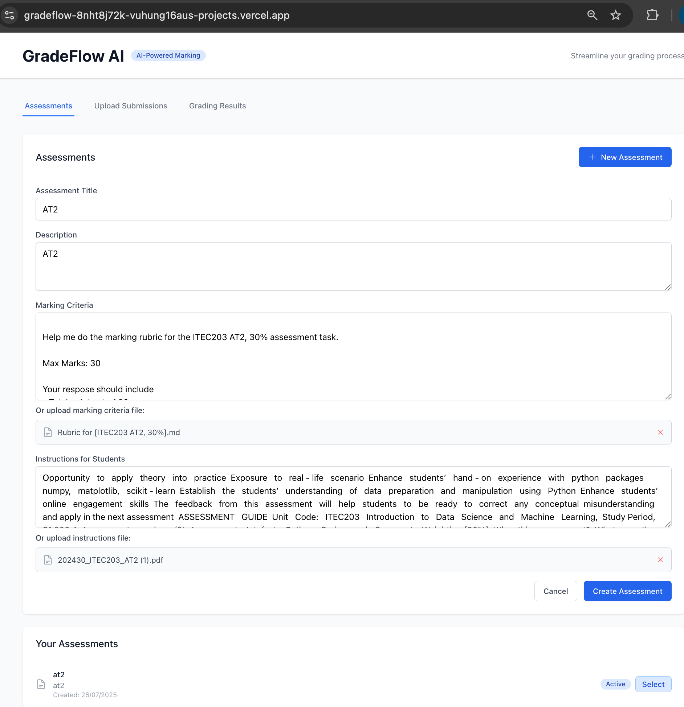
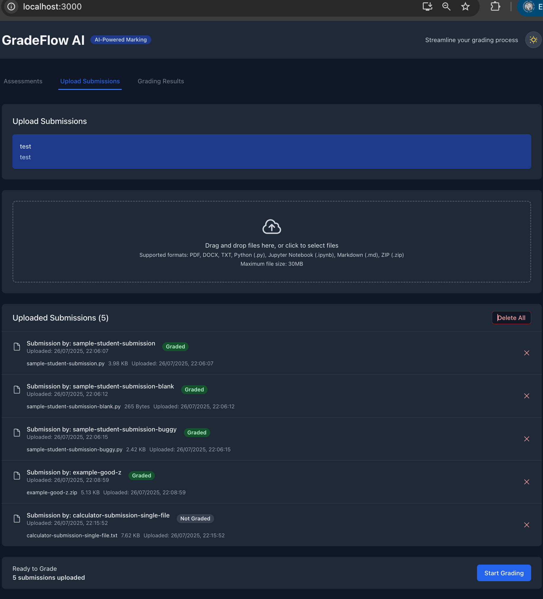
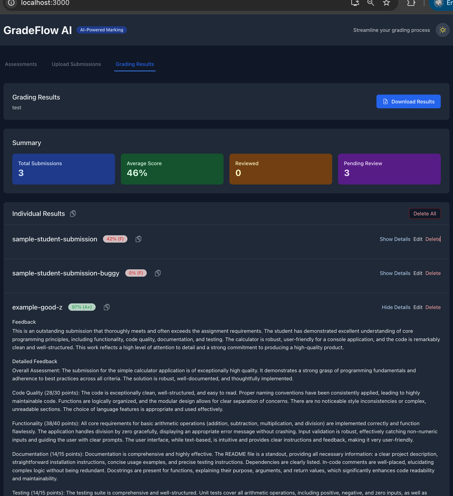

# GradeFlow AI - AI-Powered Marking Solutions

GradeFlow AI is a modern web application that leverages artificial intelligence to automate the assessment of student work, providing efficient and consistent grading for lecturers and teachers.

## ✨ Latest Features

### 🆕 Recent Updates
- **📁 Folder & ZIP Upload Support**: Upload entire folders or ZIP files as single student submissions
- **📋 One-Click Copy Results**: Copy grading results to clipboard with a single click
- **🌙 Dark/Light Mode**: Toggle between dark and light themes for better user experience
- **📄 Markdown File Support**: Upload and process Markdown (.md) files for assessments and submissions
- **🗑️ Enhanced Management**: Delete individual submissions, grades, and assessments
- **📊 Improved Results View**: Better color contrast in dark mode and detailed assessment information
- **📈 Increased File Size**: Support for files up to 30MB
- **📝 Detailed Assessment View**: Scrollable assessment details with comprehensive information
- **🎯 Batch Processing**: Treat multiple files as single student submissions for efficient grading

### 🔧 Core Features
- **AI-Powered Grading**: Uses Google Gemini API for intelligent assessment
- **Multiple File Formats**: Supports PDF, DOCX, TXT, Python (.py), Jupyter Notebook (.ipynb), and Markdown (.md)
- **Assessment Management**: Create and manage assessments with custom marking criteria and file uploads
- **Batch Processing**: Upload multiple student submissions for batch grading
- **Detailed Feedback**: AI-generated feedback with strengths, weaknesses, and suggestions
- **Results Management**: Review, edit, and download grading results
- **Modern UI**: Clean, responsive interface built with React and Tailwind CSS

## 🚀 Quick Start

### Prerequisites
- Node.js (v18 or later)
- Google Gemini API key

### Installation

1. **Clone the repository**:
   ```bash
   git clone https://github.com/vuhung16au/gradeflow-ai
   cd gradeflow-ai
   ```

2. **Install dependencies**:
   ```bash
   npm install
   ```

3. **Set up environment variables**:
   ```bash
   cp env.example .env.local
   ```
   
   **For Local Development:**
   Edit `.env.local` and add your Google Gemini API key:
   ```
   REACT_APP_GEMINI_API_KEY=your_actual_api_key_here
   ```
   
   **For Production Deployment on Vercel:**
   - Add `GEMINI_API_KEY` as a server environment variable in Vercel dashboard
   - The app automatically uses secure backend API routes in production
   - API key is handled securely on the backend via `/api/gemini.js`
   
   Get your API key from: https://aistudio.google.com/app/apikey

4. **Start the development server**:
   ```bash
   npm start
   ```

The application will be available at `http://localhost:3000`.

## 📖 How to Use GradeFlow AI

### 1. Create an Assessment
- Navigate to the "Assessments" tab
- Click "New Assessment"
- Fill in the assessment details:
  - **Title and Description**: Clear, descriptive names for your assessment
  - **Marking Criteria**: Detailed rubrics for grading - can be typed or uploaded as a file
  - **Instructions**: Guidelines for students - can be typed or uploaded as a file
- **File Upload Support**: Upload TXT, MD, PDF, or DOCX files for marking criteria and instructions
- **Save and Manage**: Your assessments are automatically saved and can be deleted individually

### 2. Upload Student Submissions
- Select an assessment from your created assessments
- Go to the "Upload Submissions" tab
- **Multiple Upload Options**:
  - **Individual Files**: Drag and drop individual files or click to browse
  - **Folder Upload**: Upload entire folders as single student submissions
  - **ZIP Files**: Upload ZIP archives containing multiple files
- **Supported Formats**: PDF, DOCX, TXT, Python (.py), Jupyter Notebook (.ipynb), Markdown (.md)
- **File Size Limit**: Up to 30MB per file
- **Batch Processing**: Multiple files are treated as single student submissions

### 3. Start AI Grading
- Ensure your Gemini API key is properly configured (check connection status)
- Review uploaded submissions in the list
- Click "Start Grading" to begin the AI assessment process
- The system analyzes each submission against your marking criteria
- **Real-time Processing**: Monitor grading progress and connection status

### 4. Review and Manage Results
- View detailed grading results in the "Grading Results" tab
- **Comprehensive Feedback**: Review AI-generated feedback, scores, and suggestions
- **Edit Results**: Modify scores, feedback, and detailed comments as needed
- **Copy Results**: Use one-click copy to clipboard for easy sharing
- **Download Results**: Export results as JSON for record-keeping
- **Delete Management**: Remove individual results or clear all results
- **Review Status**: Track which results have been reviewed

### 5. Theme and Interface
- **Dark/Light Mode**: Toggle between themes using the sun/moon icon
- **Responsive Design**: Works seamlessly on desktop and mobile devices
- **Intuitive Navigation**: Tab-based interface for easy workflow management

## 🛠️ Technology Stack

### Frontend Framework
- **React 19.1.0**: Latest React with modern hooks and features
- **TypeScript 4.9.5**: Type-safe development with comprehensive type definitions
- **React DOM 19.1.0**: React rendering for web applications

### UI & Styling
- **Tailwind CSS 3.4.17**: Utility-first CSS framework for rapid UI development
- **@tailwindcss/typography 0.5.16**: Enhanced typography styles
- **@tailwindcss/forms 0.5.10**: Better form styling
- **Headless UI 2.2.6**: Unstyled, accessible UI components
- **Heroicons 2.2.0**: Beautiful SVG icons

### AI & API Integration
- **@google/genai 1.11.0**: Official Google Generative AI SDK
- **Axios 1.11.0**: HTTP client for API requests
- **PDF.js 2.16.105**: PDF parsing and text extraction

### File Handling & Processing
- **react-dropzone 14.3.8**: Drag-and-drop file upload functionality
- **react-markdown 10.1.0**: Markdown rendering for content display
- **js-cookie 3.0.5**: Cookie management for data persistence

### Development Tools
- **Create React App 5.0.1**: React application scaffolding
- **PostCSS 8.5.6**: CSS processing
- **Autoprefixer 10.4.21**: CSS vendor prefixing
- **ESLint**: Code linting and quality assurance

### Testing Framework
- **Jest**: JavaScript testing framework
- **@testing-library/react 16.3.0**: React component testing
- **@testing-library/dom 10.4.0**: DOM testing utilities
- **@testing-library/user-event 13.5.0**: User interaction simulation

## 📁 File Format Support

| Format | Extension | Description | Use Cases |
|--------|-----------|-------------|-----------|
| PDF | .pdf | Portable Document Format | Research papers, reports, scanned documents |
| Word | .docx | Microsoft Word documents | Essays, reports, documentation |
| Text | .txt | Plain text files | Code comments, simple documents |
| Markdown | .md | Markdown formatted text | Documentation, README files, notes |
| Python | .py | Python source code | Programming assignments, scripts |
| Jupyter | .ipynb | Jupyter notebook files | Data science, computational notebooks |
| ZIP | .zip | Compressed archives | Multiple file submissions, project folders |

## 📂 Project Structure
```
src/
├── components/          # React components
│   ├── Header.tsx      # Application header with theme toggle
│   ├── AssessmentForm.tsx  # Assessment creation and management
│   ├── FileUpload.tsx  # File upload with drag-and-drop
│   ├── GradingResults.tsx  # Results display and management
│   └── ConnectionStatus.tsx # API connection status
├── services/           # API and business logic
│   ├── geminiService.ts    # Google Gemini API integration
│   └── cookieService.ts    # Local data persistence
├── types/              # TypeScript type definitions
│   └── index.ts        # Core type interfaces
├── utils/              # Utility functions
│   └── fileUtils.ts    # File processing utilities
└── App.tsx             # Main application component
```

## 🚀 Available Scripts

- `npm start` - Start development server
- `npm run build` - Build for production
- `npm test` - Run tests
- `npm run eject` - Eject from Create React App
- `npm run dev` - Alias for npm start

## 📸 Screenshots





## 📝 License

This project is licensed under the MIT License.

