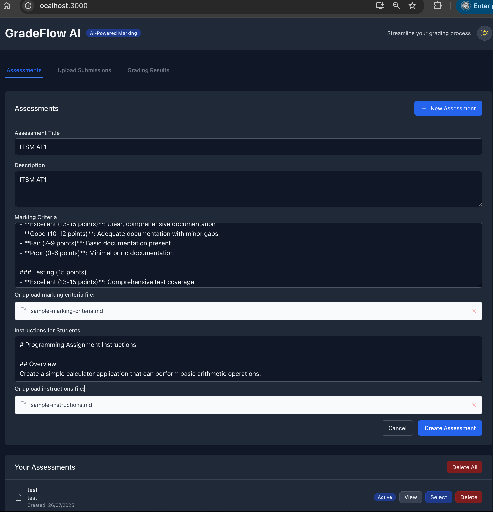

# GradeFlow AI - AI-Powered Marking Solutions

GradeFlow AI is a modern web application that leverages artificial intelligence to automate the assessment of student work, providing efficient and consistent grading for lecturers and teachers.

## Features

- **AI-Powered Grading**: Uses Google Gemini API for intelligent assessment
- **Multiple File Formats**: Supports PDF, DOCX, TXT, Python (.py), Jupyter Notebook (.ipynb), and Markdown (.md)
- **Assessment Management**: Create and manage assessments with custom marking criteria and file uploads
- **Batch Processing**: Upload multiple student submissions for batch grading
- **Detailed Feedback**: AI-generated feedback with strengths, weaknesses, and suggestions
- **Results Management**: Review, edit, and download grading results
- **Modern UI**: Clean, responsive interface built with React and Tailwind CSS

## Prerequisites

- Node.js (v18 or later)
- Google Gemini API key

## Installation

1. **Clone the repository**:
   ```bash
   git clone <repository-url>
   cd gradeflow-ai
   ```

2. **Install dependencies**:
   ```bash
   npm install
   ```

3. **Set up environment variables**:
   ```bash
   cp env.example .env.local
   ```
   
   **For Local Development:**
   Edit `.env.local` and add your Google Gemini API key:
   ```
   REACT_APP_GEMINI_API_KEY=your_actual_api_key_here
   ```
   
   **For Production Deployment on Vercel:**
   - Add `GEMINI_API_KEY` as a server environment variable in Vercel dashboard
   - The app automatically uses secure backend API routes in production
   - API key is handled securely on the backend via `/api/gemini.js`
   
   Get your API key from: https://makersuite.google.com/app/apikey

4. **Start the development server**:
   ```bash
   npm start
   ```

The application will be available at `http://localhost:3000`.

## Usage

### 1. Create an Assessment
- Navigate to the "Assessments" tab
- Click "New Assessment"
- Fill in the assessment details:
  - Title and description
  - Marking criteria (detailed rubrics) - can be typed or uploaded as a file
  - Instructions for students - can be typed or uploaded as a file
- **File Upload Support**: You can upload TXT, MD, PDF, or DOCX files for marking criteria and instructions

### 2. Upload Student Submissions
- Select an assessment
- Go to the "Upload Submissions" tab
- Drag and drop student files or click to browse
- Supported formats: PDF, DOCX, TXT, Python (.py), Jupyter Notebook (.ipynb)

### 3. Start AI Grading
- Ensure your Gemini API key is properly configured
- Click "Start Grading" to begin the AI assessment process
- The system will analyze each submission against your marking criteria

### 4. Review and Manage Results
- View detailed grading results in the "Grading Results" tab
- Review AI-generated feedback, scores, and suggestions
- Edit results if needed
- Download results as JSON for record-keeping

## Technology Stack

- **Frontend**: React 18, TypeScript, Tailwind CSS
- **AI Model**: Google Gemini API 
- **File Handling**: react-dropzone for file uploads
- **State Management**: React hooks and browser cookies for persistence
- **UI Components**: Headless UI and Heroicons

## File Format Support

| Format | Extension | Description |
|--------|-----------|-------------|
| PDF | .pdf | Portable Document Format (text extraction supported) |
| Word | .docx | Microsoft Word documents |
| Text | .txt | Plain text files |
| Markdown | .md | Markdown formatted text |
| Python | .py | Python source code |
| Jupyter | .ipynb | Jupyter notebook files |

**Note**: PDF files are now properly parsed to extract text content instead of displaying raw binary data.


## Development

### Project Structure
```
src/
├── components/          # React components
│   ├── Header.tsx
│   ├── AssessmentForm.tsx
│   ├── FileUpload.tsx
│   ├── GradingResults.tsx
│   └── ConnectionStatus.tsx
├── services/           # API and business logic
│   ├── geminiService.ts
│   └── cookieService.ts
├── types/              # TypeScript type definitions
│   └── index.ts
├── utils/              # Utility functions
│   └── fileUtils.ts
└── App.tsx             # Main application component
```

### Available Scripts

- `npm start` - Start development server
- `npm run build` - Build for production
- `npm test` - Run tests
- `npm run eject` - Eject from Create React App


### Build Issues
- Clear node_modules and reinstall: `rm -rf node_modules && npm install`
- Check Node.js version compatibility
- Verify all dependencies are installed


## License

This project is licensed under the MIT License.

## Screenshots



